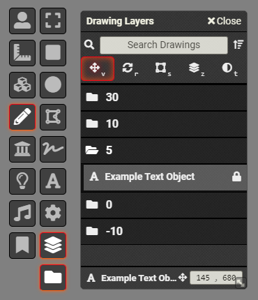

# Foundry VTT – Layers-Panel
A Foundry VTT Module that adds a layers-panel tool to the inbuilt drawing-tools.

| 0.2.0 Release Screenshot |
|----|
|  |

## Module
The 0.2.0 release makes some bigger workflow/feature changes, so any bug reports or usability improvement suggestions are much appreciated! :)

Please report any bugs, issues, or suggestions in the [issues tracker](https://github.com/bluesatin/foundry-vtt-layers-panel/issues).

## Installation
The module is available on the inbuilt Foundry VTT module finder, or alternatively you can manually install the module by using the module.json URL:  
`https://github.com/bluesatin/foundry-vtt-layers-panel/releases/latest/download/module.json`

Once installed and activated in your world, you can access the panel by going into the drawing-tools in the top left and there should now be an extra button at the bottom of the drawing-tools as shown in the preview screenshot.

## Project Details
Designed for assisting people in creating basic battle-maps in Foundry VTT using the inbuilt drawings layer and tools. 

Currently the default Foundry VTT workflow makes the selection and modification of objects very awkward when they're layered on top of each other, which is the initial workflow problem I wanted to fix for myself, hence the start of the project. I'd like to implement some further workflow improvements for building maps within Foundry VTT in the future, so if you have any ideas on simple workflow improvements, feel free to check the [issues tracker](https://github.com/bluesatin/foundry-vtt-layers-panel/issues) and add your suggestion if it's not already present.
