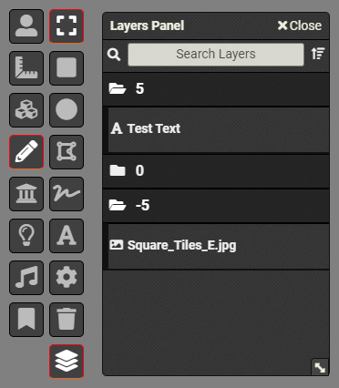

# Foundry VTT – Layers-Panel
A Foundry VTT Module that adds a layers-panel tool to the inbuilt drawing-tools.

## Details
Initial proof-of-concept release, likely to be rough around the edges.

Designed for assisting people in creating basic battle-maps in Foundry VTT using the drawing-tools canvas layer. Currently the default workflow makes the selection and modification of objects very awkward when they're layered on top of each other.

I'd like to implement a bunch of extra workflow improvements for building battle-maps, but improving the ability to actually select objects seemed like the most annoying problem to fix first.

## Preview
| Initial Release Screenshot |
|----|
|  |